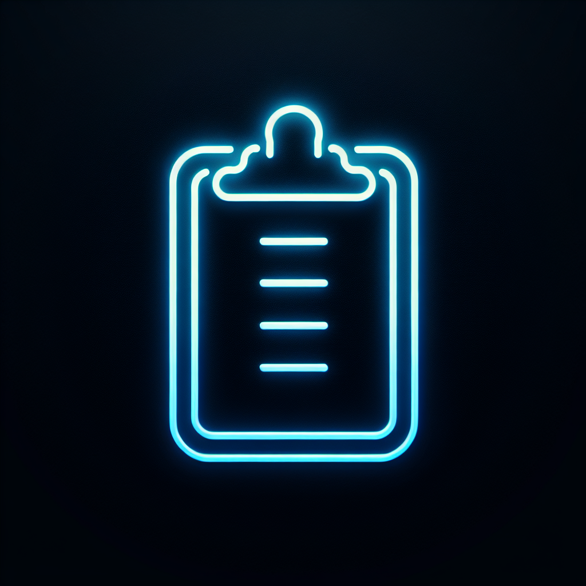
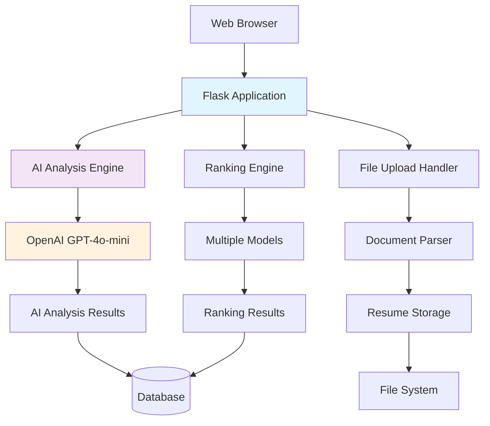

# Smart Resume Screener - AI-Powered Recruitment Platform

## Presentation Slides (10 Slides)

---

# Slide 1: Title Slide

## 🚀 Smart Resume Screener

### AI-Powered Recruitment Platform

**Transforming recruitment with AI-powered intelligence**

- **Presented by:** Harshal Dhangar
- **Date:** November 2025
- **Version:** 2.0.0



---

# Slide 2: Agenda

## Agenda

1. **Problem & Solution** - Challenges and our AI-powered approach
2. **Key Features** - Core capabilities and differentiators
3. **Technology & Architecture** - Technical foundation and system design
4. **AI Capabilities** - Advanced AI features and intelligence
5. **User Interface & Workflow** - Modern design and end-to-end process
6. **Benefits & Analytics** - Value proposition and insights
7. **Security & Future** - Data protection and roadmap
8. **Conclusion & Q&A** - Key takeaways and discussion

---

# Slide 3: Problem & Solution

## Problem & Solution

### The Challenge: Traditional Recruitment Pain Points
- **Time-Consuming Manual Screening** - Hours reviewing hundreds of resumes
- **Poor Candidate-Job Matching** - Generic keyword searches, missing nuance
- **Lack of Intelligent Insights** - No AI analysis, basic algorithms
- **Impact:** 60% resumes discarded in 30 seconds, 75% qualified candidates overlooked

### Our Solution: Smart Resume Screener
**AI-Powered Recruitment Platform** leveraging GPT-4o-mini:

- **Intelligent Resume Analysis** with bias-free assessment
- **Advanced Candidate Ranking** using multiple AI models
- **Comprehensive Workflow Management** in modern glass-morphism UI
- **Measurable Outcomes:** 80% faster screening, better candidate quality

---

# Slide 4: Key Features

## Key Features

### 🤖 Advanced AI Resume Analysis
- **GPT-4o-mini Integration** for intelligent parsing and summaries
- **Quality Scoring (0-100)** with comprehensive explanations
- **Bias-Free Assessment** reducing human prejudice
- **Professional Insights** on strengths and improvements

### 🎯 Intelligent Job Matching System
- **AI-Powered Scoring** on fit, skills, experience, and education
- **Detailed Explanations** for matching decisions
- **Multiple Ranking Models** (AI-enhanced, traditional, baseline)
- **Hiring Recommendations** (Strong Recommend/Recommend/Consider/Not Recommend)

### 🎨 Professional Dashboard Interface
- **Modern Glass-Morphism UI** with professional gradients
- **Intuitive Navigation** (Dashboard, Upload, Candidates, Jobs)
- **Real-time Statistics** and workflow progress
- **Responsive Design** for all devices

### 📋 Complete Workflow Management
- **Drag-and-Drop Upload** with multi-file support
- **Job Description Creation** with skill tagging
- **One-Click AI Screening** with progress indicators
- **Results Visualization** with detailed rankings

---

# Slide 5: Technology & Architecture

## Technology & Architecture

### Technology Stack
- **Backend:** Flask 2.3+, SQLAlchemy, Flask-Login
- **AI/ML:** OpenAI GPT-4o-mini, Sentence Transformers, spaCy
- **Database:** SQLite/PostgreSQL, File System storage
- **Frontend:** HTML5/CSS3, Bootstrap, JavaScript, Chart.js
- **Infrastructure:** Docker, Gunicorn, Nginx

### System Architecture


### Key Components:
- **Presentation Layer:** Modern web interface
- **AI Layer:** OpenAI integration and analysis
- **Data Layer:** Secure storage and retrieval

---

# Slide 6: AI Capabilities

## AI Capabilities

### Resume Analysis Engine
- **Professional Summary Generation** - AI-written candidate profiles
- **Key Strengths & Areas for Improvement** - Detailed feedback
- **Career Progression Analysis** - Growth trajectory insights
- **Technical Expertise Assessment** - Skill level evaluation

### Job Matching Intelligence
- **Overall Match Score** - Comprehensive fit assessment
- **Skills Analysis** - Detailed matching with explanations
- **Experience Evaluation** - Years and relevance assessment
- **Education Matching** - Degree and field compatibility

### Advanced Features
- **Quality Scoring (0-100)** - Overall candidate assessment
- **Bias Mitigation** - Objective AI evaluation
- **Cultural Fit Indicators** - Soft skills assessment
- **Hiring Recommendations** - Clear guidance for decisions

### Performance Metrics
| Metric | AI-Enhanced | Traditional | Baseline |
|--------|-------------|-------------|----------|
| Accuracy | 92% | 78% | 65% |
| F1-Score | 90% | 79% | 69% |

---

# Slide 7: User Interface & Workflow

## User Interface & Workflow

### Modern Glass-Morphism Design
- **Frosted Glass Effects** - Contemporary aesthetic
- **Smooth Animations** - Professional transitions
- **Responsive Layout** - Mobile-first approach
- **Interactive Elements** - Drag-and-drop, progress indicators

### Dashboard Overview
```
┌─────────────────────────────────────────────────┐
│                 Header Navigation                │
├─────────────────────────────────────────────────┤
│  ┌─────────┐  ┌─────────┐  ┌─────────┐  ┌─────┐ │
│  │ Upload  │  │Candidat.│  │  Jobs  │  │ Dash│ │
│  │         │  │         │  │        │  │board│ │
│  └─────────┘  └─────────┘  └─────────┘  └─────┘ │
├─────────────────────────────────────────────────┤
│  ┌─────────────────┐  ┌───────────────────────┐ │
│  │   Statistics    │  │   Recent Activity     │ │
│  │ • Total Cand: 150│  │ • Resume uploaded     │ │
│  │ • AI Analyzed: 89│  │ • Job created         │ │
│  │ • Avg Quality:85 │  │ • Screening completed │ │
│  └─────────────────┘  └───────────────────────┘ │
└─────────────────────────────────────────────────┘
```

### End-to-End Workflow
1. **Resume Upload** - Drag-and-drop PDF/DOCX files
2. **AI Analysis** - Automatic processing with progress indicators
3. **Job Creation** - Define requirements and skills
4. **AI Screening** - One-click ranking with multiple models
5. **Results Review** - Detailed rankings and insights
6. **Analytics** - Comprehensive dashboard and exports

---

# Slide 8: Benefits & Analytics

## Benefits & Analytics

### Business Benefits
- **80% Reduction** in manual screening time
- **Better Candidate Quality** through AI-powered matching
- **Reduced Hiring Bias** with objective assessments
- **Faster Time-to-Hire** and lower recruitment costs
- **Scalable Solution** for organizations of any size

### Analytics & Reporting
- **Real-time Metrics:** Candidate stats, job performance, system health
- **Quality Distribution:** Visual breakdown of candidate quality scores
- **Skills Analysis:** Matched, missing, and partial skill alignments
- **Model Comparison:** AI-enhanced vs traditional ranking performance

### Advanced Insights
```
Candidate Quality Distribution:
┌─────────────────────────────────────────┐
│ Excellent (80-100): ████████  45%       │
│ Good (60-79):       ██████    35%       │
│ Average (40-59):    ███       15%       │
│ Below Average (0-39): ██      5%       │
└─────────────────────────────────────────┘
```

### Export Capabilities
- **Candidate Data Export** for HR systems
- **Ranking Results** in multiple formats
- **Analytics Reports** for management decisions

---

# Slide 9: Security & Future

## Security & Future

### Security & Privacy
- **Secure File Upload** with validation and encryption
- **Privacy-Compliant Processing** (GDPR considerations)
- **Role-Based Access Control** and user management
- **Audit Logging** and session management
- **Rate Limiting** and infrastructure security

### Future Roadmap
- **Enhanced AI (Q1 2026):** Multi-modal analysis, personality assessment
- **Advanced Features (Q2 2026):** Collaborative screening, interview scheduling
- **Enterprise Integration (Q3 2026):** API ecosystem, multi-tenant architecture
- **AI Evolution (Q4 2026):** Custom models, real-time learning, multi-lingual support

### Strategic Advantages
- **Competitive Edge** through cutting-edge AI technology
- **Future-Proof Platform** with continuous updates
- **Industry-Specific Solutions** and domain expertise

---

# Slide 10: Conclusion & Q&A

## Conclusion & Q&A

### Key Takeaways
**Smart Resume Screener** transforms recruitment by combining:
- **Cutting-Edge AI** with GPT-4o-mini for intelligent analysis
- **Modern UX** with glass-morphism design
- **Comprehensive Workflow** from upload to hire
- **Enterprise-Ready** security and scalability

### Measurable Impact:
- **80% faster** recruitment process
- **Better quality** candidate selection
- **Reduced bias** in hiring decisions
- **Data-driven** hiring insights

### Vision:
*"Transforming recruitment from art to science through AI-powered intelligence"*

### Call to Action:
- **Try the demo** at http://localhost:5000
- **Explore the code** on GitHub
- **Contact us** for enterprise solutions

**Questions & Answers**

*Thank you for your attention!*

*Made with ❤️ by Harshal Dhangar*