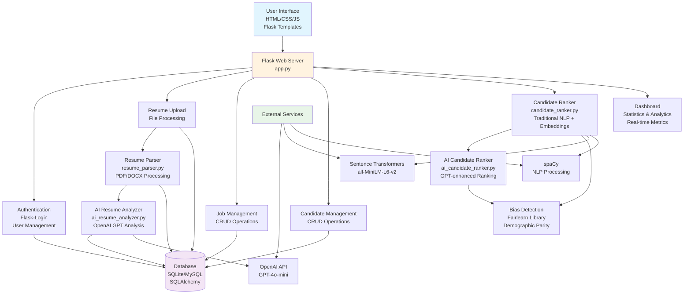
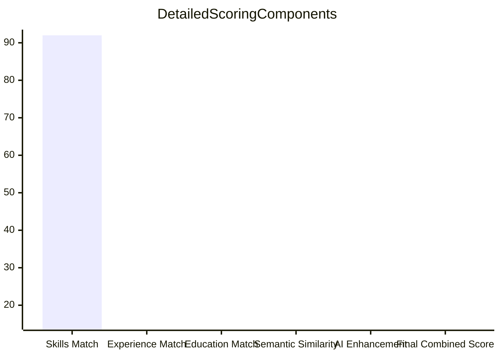
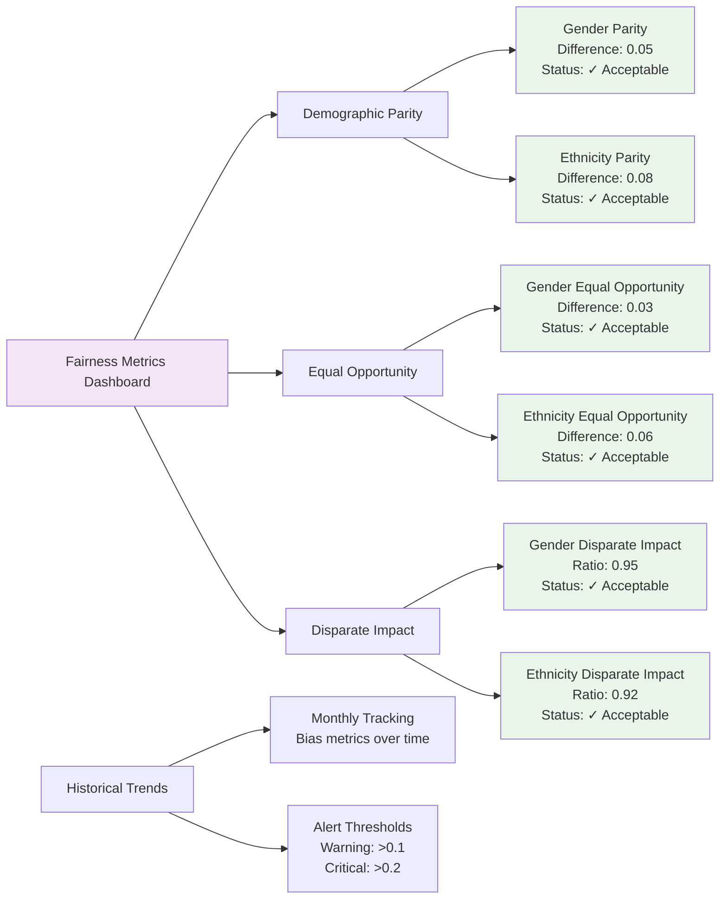
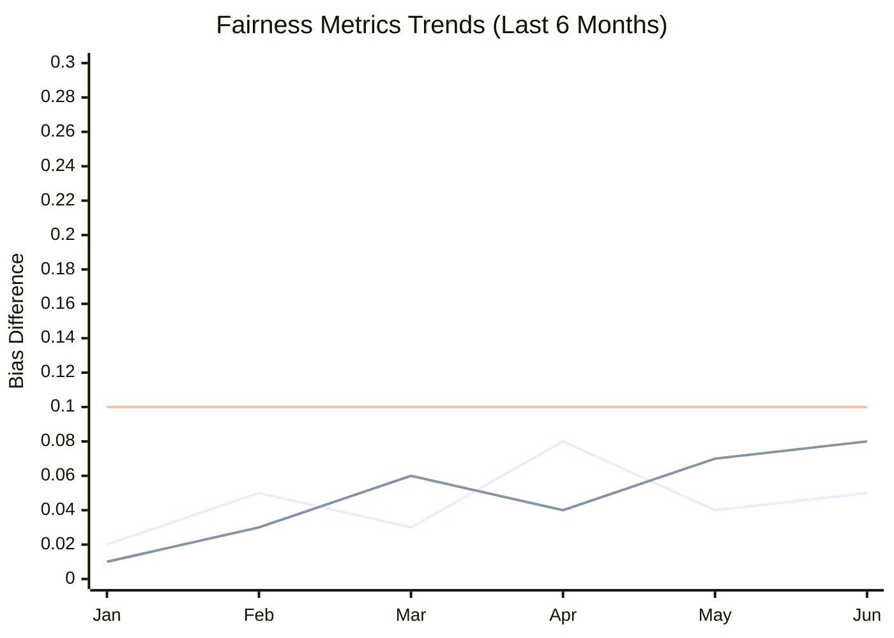
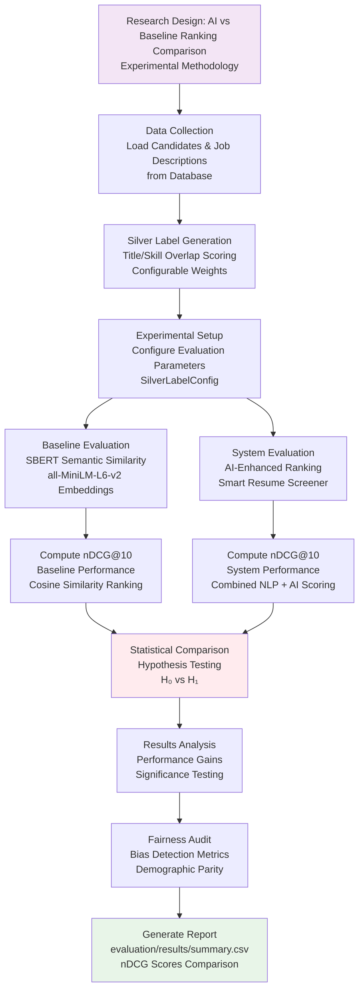

# Smart Resume Screener - Figures and Diagrams

This document contains all the figures and diagrams for the Smart Resume Screener system.

## List of Figures

1. [System Architecture of Smart Resume Screener](#figure-1-system-architecture-of-smart-resume-screener)
2. [Candidate Ranking Workflow](#figure-2-candidate-ranking-workflow)
3. [Dashboard UI Design](#figure-3-dashboard-ui-design)
4. [Bias Detection Flowchart](#figure-4-bias-detection-flowchart)
5. [Example Candidate Score Breakdown](#figure-5-example-candidate-score-breakdown)
6. [Fairness Metrics Visualization](#figure-6-fairness-metrics-visualization)
7. [Research Design Methodology](#figure-7-research-design-methodology)

---

## Figure 1: System Architecture of Smart Resume Screener



**Description:** The system architecture shows a Flask-based web application with modular components for resume processing, AI analysis, candidate ranking, and bias detection. The core components include user authentication, file upload handling, database operations, and integration with external AI services.

---

## Figure 2: Candidate Ranking Workflow

```mermaid
flowchart TD
    A[Start: Job Description Created] --> B[User Selects Ranking Model]
    B --> C{Model Type?}

    C -->|AI-Enhanced| D[Load Base Ranker<br/>candidate_ranker.py]
    C -->|Traditional| E[Load Traditional Ranker<br/>candidate_ranker.py]
    C -->|Baseline| F[Load Baseline Ranker<br/>baseline_ranker.py]

    D --> G[Perform Base Ranking<br/>Skill/Experience/Education Matching]
    E --> G
    F --> H[Perform TF-IDF Ranking]

    G --> I[Check AI Availability<br/>ai_analyzer.is_available()]
    I -->|AI Available| J[Enhance Rankings with AI<br/>ai_candidate_ranker.py]
    I -->|AI Not Available| K[Use Base Rankings Only]

    J --> L[AI Job Match Analysis<br/>Per Candidate]
    L --> M[Combine Scores<br/>60% Traditional + 40% AI]

    H --> N[Return Baseline Rankings]
    K --> N
    M --> N

    N --> O[Sort by Final Score<br/>Descending Order]
    O --> P[Audit Bias<br/>audit_bias_in_ranking()]
    P --> Q[Log Demographic Outcomes]
    Q --> R[Return Ranked Candidates<br/>With Scores & Analytics]

    style A fill:#e8f5e8
    style R fill:#ffebee
```

**Description:** The candidate ranking workflow supports multiple ranking models (AI-enhanced, traditional semantic, baseline TF-IDF). The AI-enhanced model combines traditional NLP scoring with GPT-based analysis, includes bias auditing, and provides comprehensive scoring breakdowns.

---

## Figure 3: Dashboard UI Design

```mermaid
graph TD
    A[Dashboard Layout<br/>Glass-morphism Design] --> B[Header Section]
    A --> C[Statistics Cards]
    A --> D[Navigation Tabs]
    A --> E[Recent Activities]
    A --> F[Top Candidates Preview]

    B --> B1[Logo & Title<br/>Smart Resume Screener]
    B --> B2[User Menu<br/>Profile/Logout]

    C --> C1[Total Candidates<br/>Animated Counter]
    C --> C2[Active Jobs<br/>Animated Counter]
    C --> C3[AI Analyzed<br/>Progress Indicator]
    C --> C4[Avg Quality Score<br/>Gauge Chart]

    D --> D1[Dashboard Tab<br/>Active]
    D --> D2[Upload Tab]
    D --> D3[Candidates Tab]
    D --> D4[Jobs Tab]

    E --> E1[Resume Uploaded<br/>2 hours ago]
    E --> E2[Job Created<br/>Just now]
    E --> E3[AI Analysis Completed<br/>1 hour ago]

    F --> F1[Candidate 1<br/>Quality: 92%]
    F --> F2[Candidate 2<br/>Quality: 88%]
    F --> F3[Candidate 3<br/>Quality: 85%]

    G[Responsive Design] --> H[Desktop Layout<br/>4-column grid]
    G --> I[Tablet Layout<br/>2-column grid]
    G --> J[Mobile Layout<br/>Single column]

    style A fill:#f3e5f5
    style C fill:#e1f5fe
    style G fill:#fff3e0
```



**Description:** The dashboard features a modern glass-morphism UI with four main tabs, real-time statistics, recent activity feed, and top candidate previews. The design is fully responsive across desktop, tablet, and mobile devices.

---

## Figure 4: Bias Detection Flowchart

```mermaid
flowchart TD
    A[Ranking Process Complete] --> B[Extract Sensitive Attributes<br/>Gender, Ethnicity]
    B --> C[Extract Ranking Scores<br/>total_score for each candidate]

    C --> D{Check Fairlearn<br/>Available?}
    D -->|Yes| E[Calculate Selection Rates<br/>Top 10% as selected]
    D -->|No| F[Skip Bias Audit<br/>Log Warning]

    E --> G[Compute Demographic Parity<br/>demographic_parity_difference()]
    G --> H[Log Results<br/>demographic_parity_difference value]

    H --> I[Check Threshold<br/>|difference| > 0.1]
    I -->|Bias Detected| J[Log Warning<br/>Potential bias in ranking]
    I -->|Acceptable| K[Log Info<br/>Bias within acceptable range]

    F --> L[End Bias Audit]
    J --> L
    K --> L

    L --> M[Continue with Rankings<br/>Display results to user]

    style A fill:#ffebee
    style L fill:#e8f5e8
```

**Description:** The bias detection process uses Fairlearn library to audit ranking fairness. It calculates demographic parity differences for sensitive attributes like gender and ethnicity, logging warnings when bias exceeds acceptable thresholds.

---

## Figure 5: Example Candidate Score Breakdown




**Description:** This example shows how individual scoring components (skills, experience, education, semantic similarity) combine to create the final candidate score. The AI-enhanced model further refines this with GPT analysis.

---

## Figure 6: Fairness Metrics Visualization





**Description:** The fairness metrics visualization tracks demographic parity, equal opportunity, and disparate impact across protected attributes. Historical trends help identify patterns and ensure ongoing fairness in the ranking system.
7. [Research Design Methodology](#figure-7-research-design-methodology)

---

## Figure 7: Research Design Methodology



**Description:** The research design follows an experimental methodology comparing AI-enhanced candidate ranking against SBERT baseline methods. Silver labels are generated from job-candidate data using title and skill overlap, then nDCG@10 is computed for both approaches to test the hypothesis that AI improves ranking quality. The design includes fairness auditing to ensure ethical evaluation.